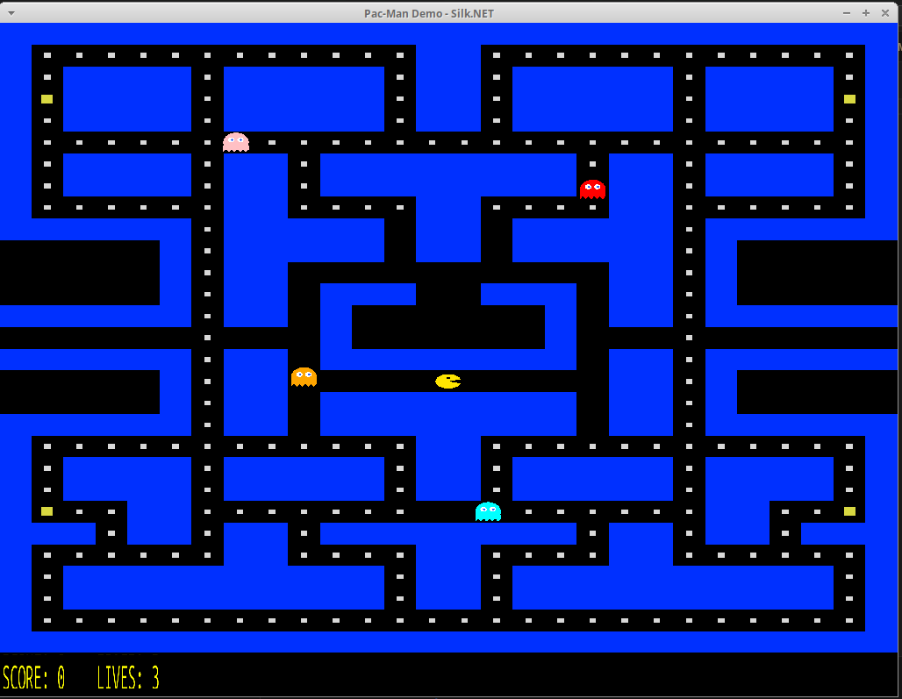
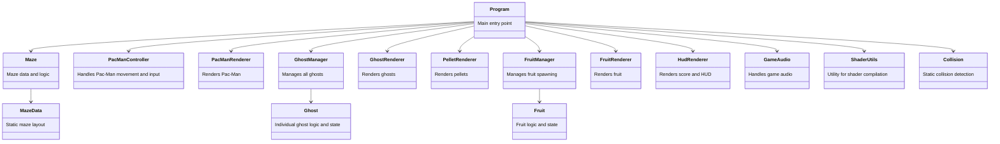

# Pacman Demo
Developed Pacman in C# with help from Chat GPT and Github Copilot.

## History of Pac-Man
Pac-Man is a classic arcade game released in 1980 by Namco. It became one of the most iconic and influential video games of all time, known for its simple yet addictive gameplay, memorable characters, and cultural impact. Players control Pac-Man as he navigates a maze, eating pellets and avoiding ghosts.

## Project Goals and AI Assistance
My goal was to program a Pac-Man demo using C# and Visual Studio Code editor integrated with Github Copilot, with the assistance of ChatGPT 4.0 and GitHub Copilot. I had never coded Pac-Man or worked with OpenGL before starting this project.

The AI was immensely helpful in getting the project started:
- It recommended using Silk.NET for graphics and OpenGL integration.
- It generated a "Hello OpenGL World" application.
- It created the maze data structure.
- It generated the vertex and fragment shaders for rendering.
- It provided scaffolding for Pac-Man movement and collision detection.
- It provided scaffolding for ghost movement and collision detection.

As the project progressed, the AI started to falter on more complex game logic, but its assistance was invaluable for the initial setup and foundational code.  But even when it could not generate the code accurately for the more complex scenarios, it still provided a good explanation and foundation of what to do.  When things got complex, it started having "hallucinations", but overall it was very helpful and I learned a little about Pacman and OpenGL!

## Class Diagram
Below is a class diagram showing the main classes in this Pac-Man project and their responsibilities:

