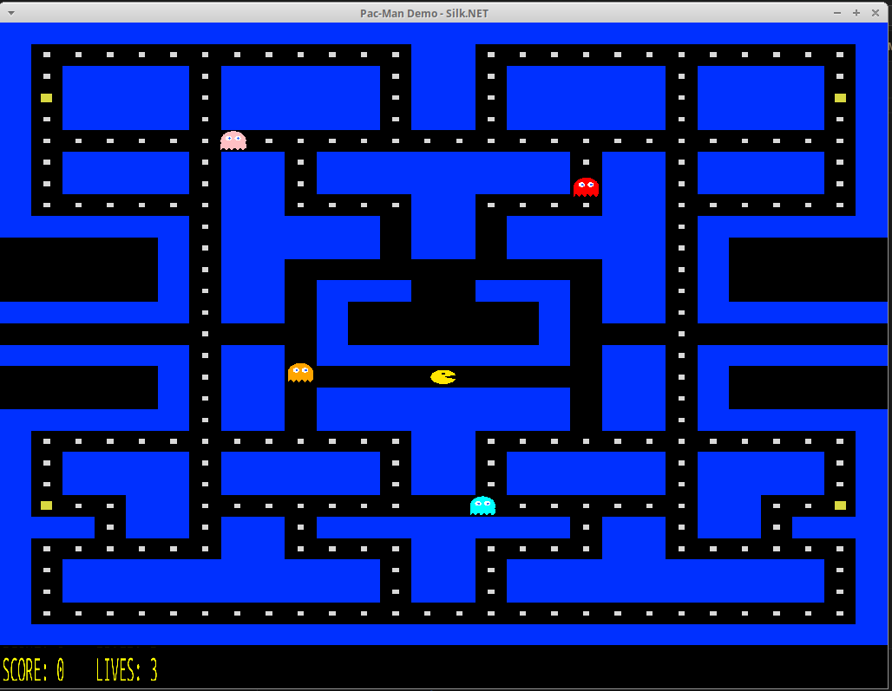
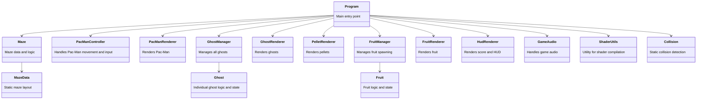
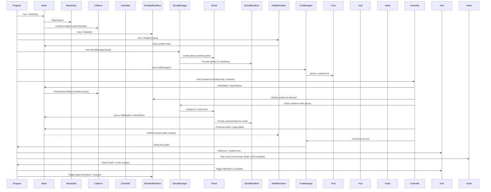

# PacMan Demo

Developed PacMan in C# with help from ChatGPT and GitHub Copilot.



## Developer prerequisites

- Install the [.NET 8 SDK](https://dotnet.microsoft.com/download/dotnet/8.0).
- Place a valid `sixlabors.lic` file in the project root. Request a license from
  [Six Labors](https://licensing.sixlabors.com/). The file is intentionally
  ignored by Git and must not be committed.
- Install a current Intel, AMD, or NVIDIA graphics driver with OpenGL support.
- Install or provide the native GLFW and OpenAL libraries described below.

Restore, build, and run the project with:

```bash
dotnet restore
dotnet build --configuration Release
dotnet run
```

### Native dependency model

The C# code uses Silk.NET bindings:

- `Silk.NET.Windowing` and `Silk.NET.GLFW` call the native GLFW library to
  create the window and OpenGL context and handle input.
- `Silk.NET.OpenGL` calls the OpenGL implementation supplied by the installed
  GPU driver. Silk.NET does not provide a software OpenGL renderer.
- `Silk.NET.OpenAL` calls a native OpenAL implementation. OpenAL Soft performs
  audio mixing in software and normally sends the final stream through the
  operating system's audio backend.

The release workflow publishes self-contained .NET 8 executables. This bundles
the .NET runtime, but it does not eliminate native operating-system, graphics,
windowing, and audio dependencies.

### Windows x64 development

The preferred deployment is to place native DLLs beside `PacMan.exe`:

- `glfw3.dll`: the project resolves GLFW through the `Ultz.Native.GLFW` NuGet
  dependency. Verify that the published package contains the x64 DLL. If it is
  absent, download the official
  [GLFW 3.4 Windows 64-bit binaries](https://github.com/glfw/glfw/releases/download/3.4/glfw-3.4.bin.WIN64.zip)
  and copy `lib-vc2022/glfw3.dll` beside the executable.
- `OpenAL32.dll`: download the official
  [OpenAL Soft binary package](https://github.com/kcat/openal-soft/releases),
  copy `bin/Win64/soft_oal.dll`, rename it to `OpenAL32.dll`, and place it
  beside the executable.

If Windows reports a missing `VCRUNTIME140.dll`, `MSVCP140.dll`, or related
runtime DLL, install the
[Microsoft Visual C++ x64 Redistributable](https://aka.ms/vc14/vc_redist.x64.exe).
Do not copy random runtime DLLs from another computer.

### Linux x64 development

Ubuntu 24.04:

```bash
sudo apt update
sudo apt install ca-certificates libc6 libgcc-s1 libgssapi-krb5-2 \
  libicu74 libssl3 libstdc++6 tzdata zlib1g \
  libopenal1 libglfw3 libgl1 \
  libx11-6 libxrandr2 libxinerama1 libxcursor1 libxi6 \
  libwayland-client0 libxkbcommon0
```

For Ubuntu 22.04, replace `libicu74` with `libicu70`. For Debian 12, use
`libicu72`.

Fedora and related distributions:

```bash
sudo dnf install ca-certificates glibc libgcc krb5-libs libicu \
  openssl-libs libstdc++ tzdata zlib openal-soft glfw mesa-libGL \
  libX11 libXrandr libXinerama libXcursor libXi \
  wayland-libs libxkbcommon
```

Linux also requires a working graphical session and GPU driver. A headless or
remote shell generally cannot open the game window unless display forwarding
is configured.

## Download

Prebuilt Windows and Linux packages are published on the
[GitHub Releases page](https://github.com/bradguru2/pacman/releases).

- Windows: download the `win-x64.zip` file, extract it, and run `PacMan.exe`.
- Linux: download the `linux-x64.tar.gz` file, extract it, and run `./PacMan`.

Each archive includes a matching `.sha256` checksum file. These packages are
self-contained, so users do not need to install the .NET runtime. Native
dependencies and troubleshooting instructions are included in each package's
`README.html`.

## Publishing a Release

The release workflow:

1. Restores `sixlabors.lic` from the `SIXLABORS_LICENSE_B64` repository secret.
2. Publishes self-contained, single-file `win-x64` and `linux-x64` builds.
3. Copies `Assets`, `README.html`, and `LICENSE` into each package.
4. Creates ZIP/TAR archives and SHA-256 checksum files.
5. Publishes the artifacts as a GitHub release.

Before tagging a release:

```bash
dotnet restore
dotnet build --configuration Release --no-restore
git status --short
```

Push the release commit, then create and push a semantic-version tag:

```bash
git push origin main
git tag -a v1.0.3 -m "PacMan v1.0.3"
git push origin v1.0.3
```

Pushing a `v*` tag runs `.github/workflows/release.yml`. After it completes:

- Download and fully extract both archives.
- Confirm the `Assets` folder and release `README.html` are present.
- Confirm the Linux executable bit is set.
- Test on clean Windows and Linux systems when practical. A development
  machine can hide dependencies that are already installed.
- On Windows, specifically verify that GLFW loads. If `glfw3.dll` is not
  available from the single-file extraction path, ship it beside `PacMan.exe`.
- Verify audio through OpenAL and update the packaged instructions if the
  required native setup changes.

The project intentionally distributes portable archives rather than
platform-specific installers. Creating and maintaining installers, signing,
elevation, upgrade, and uninstall behavior is outside the current scope.

## History of Pac-Man
Pac-Man is a classic arcade game released in 1980 by Namco. It became one of the most iconic and influential video games of all time, known for its simple yet addictive gameplay, memorable characters, and cultural impact. Players control Pac-Man as he navigates a maze, eating pellets and avoiding ghosts.

## Project Goals and AI Assistance
My goal was to program a Pac-Man demo using C# and Visual Studio Code editor integrated with Github Copilot, with the assistance of ChatGPT 4.0 and GitHub Copilot. I had never coded Pac-Man or worked with OpenGL before starting this project.

The AI was immensely helpful in getting the project started:
- It recommended using Silk.NET for graphics and OpenGL integration.
- It generated a "Hello OpenGL World" application.
- It created the maze data structure.
- It generated the vertex and fragment shaders for rendering.
- It provided scaffolding for Pac-Man movement and collision detection.
- It provided scaffolding for ghost movement and collision detection.

As the project progressed, the AI started to falter on more complex game logic, but its assistance was invaluable for the initial setup and foundational code.  But even when it could not generate the code accurately for the more complex scenarios, it still provided a good explanation and foundation of what to do.  When things got complex, it started having "hallucinations", but overall it was very helpful and I learned a little about Pacman and OpenGL!

## Class Diagram
Below is a class diagram showing the main classes in this Pac-Man project and their responsibilities:


```mermaid
classDiagram
    class Program {
        Main entry point
    }
    class Maze {
        Maze data and logic
    }
    class MazeData {
        Static maze layout
    }
    class PacManController {
        Handles Pac-Man movement and input
    }
    class PacManRenderer {
        Renders Pac-Man
    }
    class GhostManager {
        Manages all ghosts
    }
    class Ghost {
        Individual ghost logic and state
    }
    class GhostRenderer {
        Renders ghosts
    }
    class PelletRenderer {
        Renders pellets
    }
    class FruitManager {
        Manages fruit spawning
    }
    class Fruit {
        Fruit logic and state
    }
    class FruitRenderer {
        Renders fruit
    }
    class HudRenderer {
        Renders score and HUD
    }
    class GameAudio {
        Handles game audio
    }
    class ShaderUtils {
        Utility for shader compilation
    }
    class Collision {
        Static collision detection
    }
    Program --> Maze
    Program --> PacManController
    Program --> GhostManager
    Program --> FruitManager
    Maze --> MazeData
    Program --> PacManRenderer
    GhostManager --> Ghost
    Program --> GhostRenderer
    FruitManager --> Fruit
    Program --> FruitRenderer
    Program --> PelletRenderer
    Program --> HudRenderer
    Program --> GameAudio
    Program --> ShaderUtils
    Program --> Collision
```

## Class Interaction Diagram

Below is a UML-style interaction (sequence) diagram showing runtime messages and responsibilities between the core classes in this Pac-Man project.


```mermaid
sequenceDiagram
    participant Program
    participant Maze
    participant MazeData
    participant Collision
    participant PacManController as Controller
    participant PacManRenderer as PacManRenderer
    participant GhostManager as GhostManager
    participant Ghost
    participant GhostRenderer as GhostRenderer
    participant PelletRenderer as PelletRenderer
    participant FruitManager as FruitManager
    participant Fruit
    participant HudRenderer as Hud
    participant GameAudio as Audio

    Program->>Maze: new / Initialize()
    Maze->>MazeData: Read layout
    Maze->>Collision: (collision helpers used internally)
    Program->>PacManRenderer: new / Initialize()
    Program->>PelletRenderer: new / Initialize(maze)
    PelletRenderer->>Maze: Query pellets state
    Program->>GhostManager: new GhostManager(maze)
    GhostManager->>Ghost: Create ghosts (starting state)
    GhostManager->>GhostRenderer: Provide ghosts for rendering
    Program->>FruitManager: new FruitManager()
    FruitManager->>Fruit: Spawn / update fruit
    Program->>Controller: new PacManController(maze, renderer)
    Controller->>Maze: IsWalkable / HasCollision
    Maze->>Collision: CircleIntersectsRect (collision query)
    Controller->>PacManRenderer: Update position & direction
    Controller->>GhostManager: Check collisions with ghosts
    GhostManager->>Ghost: Update AI / movement
    Ghost->>Maze: Query IsWalkable / HasCollision
    Ghost->>GhostRenderer: Provide position/state for render
    Controller->>Maze: Consume pellet / super-pellet
    Maze-->>PelletRenderer: Pellet removed (state change)
    Controller->>FruitManager: Check/try-eat fruit
    FruitManager->>Program: Notify fruit eaten
    Program->>Hud: AddScore / Update lives
    Program->>Audio: Play sound events (eat, death, level complete)
    Ghost->>Program: Notify death / mode changes
    Program->>Hud: Trigger life/death UI updates
    Program->>PacManRenderer: Trigger death animation / respawn
```
